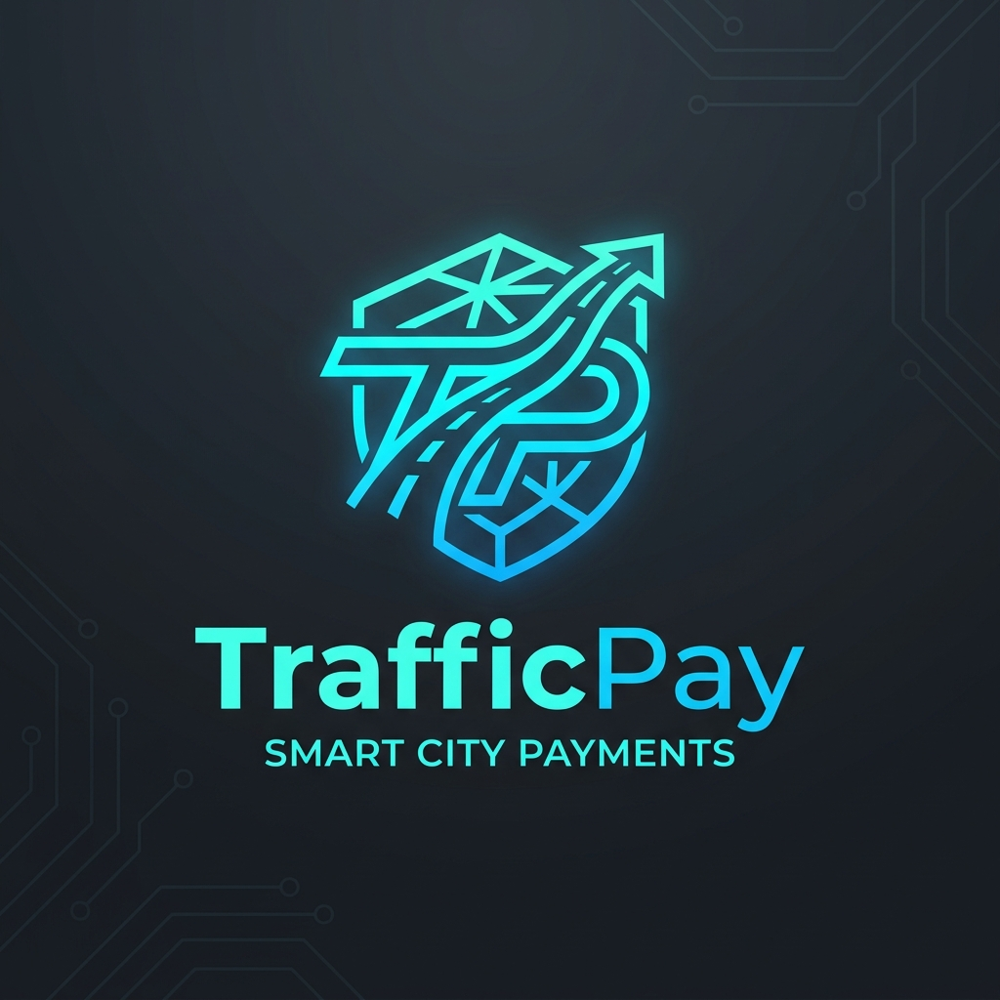
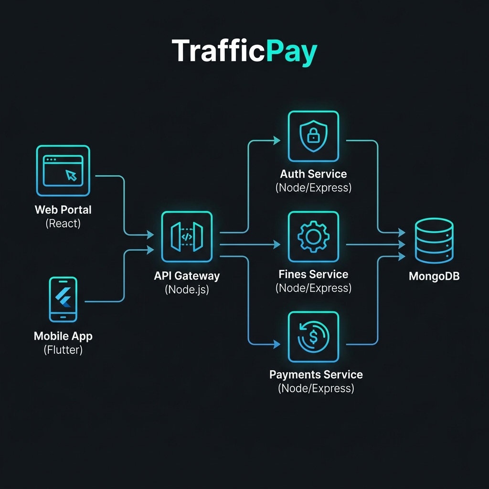

<div align="center">
  
  <h1>🚦 TrafficPay</h1>
  <p><b>Next-Generation Smart City Traffic Fine Management Ecosystem</b></p>

  <!-- Badges -->
  <p>
    
    
    
    
    
    
  </p>
</div>

---

## 📖 Overview

**TrafficPay** is a comprehensive, scalable Software Architecture project engineered to modernize how smart cities process, manage, and settle traffic violations. By departing from legacy monolithic structures, TrafficPay embraces a resilient, decoupled **Microservices Architecture**. 

This ecosystem ensures fault tolerance, dynamic scalability, and strict domain isolation, providing a seamless experience for both citizens (via the Web Portal) and law enforcement officers (via the Mobile App).

---

## 🏗️ High-Level Architecture

<div align="center">
  
  <p><i>TrafficPay Ecosystem: Decoupled MERN Microservices connected via an API Gateway.</i></p>
</div>

The backend relies on the **API Gateway Pattern** to securely marshal network traffic to isolated, lightweight microservices:

- 🛡️ **API Gateway (Port 5005)**: The central nervous system. Handles rate limiting, CORS configuration, centralized logging, and reverse-proxying.
- 🔐 **Auth Service (Port 5001)**: Dedicated identity provider. Manages RBAC (Role-Based Access Control) and issues stateless JWTs.
- 📝 **Fines Service (Port 5002)**: The core domain logic for issuing citations, querying active offenses, and determining demerit scores.
- 💳 **Payments Service (Port 5003)**: Securely handles transaction lifecycles, financial data auditing, and mock SMS receipt dispatching.

---

## 💻 Technology Stack

### 🌐 Frontend (Web Portal)
- **Framework**: React 19 (Vite)
- **Styling**: Tailwind CSS v4
- **Animations**: Framer Motion (Hardware-accelerated)
- **Routing**: React Router DOM v7

### 📱 Mobile Application (Officers)
- **Framework**: Flutter / Dart
- **Architecture**: Modular Services Pattern
- **State**: Shared Preferences for persistent Auth Tokens

### ⚙️ Backend (Microservices)
- **Runtime Environment**: Node.js
- **Server Framework**: Express.js
- **Database**: MongoDB Atlas (Cloud)
- **ODM**: Mongoose
- **Orchestration**: Docker & Docker Compose

---

## ✨ Key Features

1. 🌌 **Cinematic UI/UX:** A stunning, ultra-premium frontend featuring dynamic glassmorphism, responsive 3D assets, and seamless page transitions.
2. 🧩 **True Microservices:** Completely isolated domain services ensuring zero single-point-of-failure.
3. 🐳 **Fully Dockerized:** Entire ecosystem is containerized for "one-click" local deployments using `docker-compose`.
4. 🔒 **Stateless Security:** Robust JWT-based authentication safeguarding both Admin Web Portals and Officer Mobile Apps.
5. ⚡ **Lightning Fast Responses:** Optimized React chunking and API Gateway mapping guarantees instant query resolution.

---

## 🚀 Getting Started (Local Development)

We have fully dockerized the TrafficPay cluster. Starting the entire infrastructure takes just a single command.

### 1. Prerequisites
- [Docker Desktop](https://www.docker.com/products/docker-desktop) installed and running.
- [Flutter SDK](https://flutter.dev/docs/get-started/install) (Optional: if building the mobile app locally).

### 2. Boot the Microservices Cluster
Open your terminal in the root directory and build the containers:

```bash
docker-compose up --build
```
> **Note**: This spins up the API Gateway, Auth, Fines, Payments, and Web Portal simultaneously in isolated containers.

### 3. Access the Platforms
- 🖥️ **Web Portal**: Navigate to `http://localhost:5173`
- 📡 **API Gateway**: Listening on `http://localhost:5005`

### 4. Boot the Mobile App (Optional)
Open a new terminal window:
```bash
cd mobile-app
flutter pub get
flutter run
```

---

## 🛡️ Security Best Practices Implemented
- **No Secrets in Source Control**: Strict `.gitignore` implementations prevent `.env` file leaks.
- **Node Modules Ignored**: Minimized repository bloat.
- **Multi-stage Docker Builds**: Production-ready, non-root user execution environments for microservices.

<br>

<div align="center">
  <i>Developed meticulously for Advanced Software Architecture.</i>
</div>
